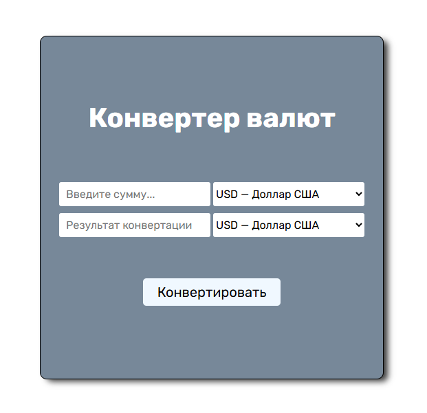

# Currency Converter

  

### [EN]

The Currency Converter is a simple web application for converting currencies (USD, EUR, GBP, RUB, TRY, CNY, KZT).
The application uses the **free API** from **ExchangeRateAPI**,
allowing real-time display of exchange rates for various currencies.

### Stack

* HTML5 (BEM)
* CSS3
* JavaScript (Vanilla)

### Warning!

Since the project is based on a free API, the key used in the project is publicly available.
In real-world projects, for security reasons, such situations should be avoided and such keys should not be made publicly available,
and this project is a typical example where such use is permitted.

### Project Link

[Currency Converter (GitHub Pages)](https://antlevchenko.github.io/currency-converter/)

### [RU]

Конвертер валют - это простое веб-приложение для конвертации валют (USD, EUR, GBP, RUB, TRY, CNY, KZT).  
Приложение работает с использованием **бесплатного API** от **ExchangeRateAPI**,  
позволяя в текущем времени отображать реальные данные курса различных валют.

### Стек

* HTML5 (BEM)
* CSS3
* JavaScript (Vanilla)

### Внимание!

Поскольку проект реализован на основе бесплатного API, ключ, используемый в проекте - является общедоступным.  
В реальных проектах в целях безопасности таких ситуаций стоит избегать и не оставлять подобные ключи в открытом доступе,  
а данный проект является обычным примером, в котором допускается такое использование.

### Ссылка на проект

[Currency Converter (GitHub Pages)](https://antlevchenko.github.io/currency-converter/)

